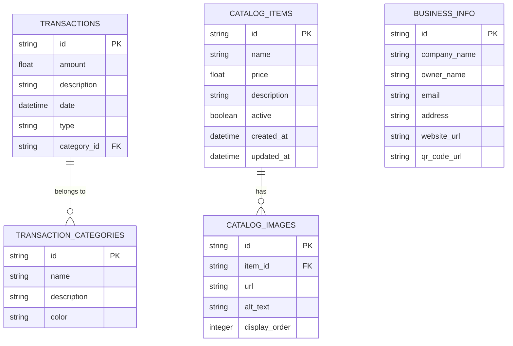

# PocketBase ER Diagram for 3DPS Budget Tracker

## Entity Descriptions

### Transactions
- Stores all financial transactions (income and expenses)
- Each transaction can be categorized
- Tracks amount, description, date, and type (income/expense)

### Transaction Categories
- Organizes transactions into categories
- Includes category name, description, and display color
- Helps in financial reporting and analysis

### Catalog Items
- Represents products/services in the catalog
- Includes pricing, description, and status information
- Tracks creation and update timestamps

### Catalog Images
- Stores images associated with catalog items
- Supports multiple images per item
- Includes display order for proper presentation

### Business Info
- Stores company details and contact information
- Contains data for digital business card
- Includes QR code information

## Relationships
1. Transactions → Transaction Categories (Many-to-One)
   - Each transaction belongs to one category
   - Categories can have multiple transactions

2. Catalog Items → Catalog Images (One-to-Many)
   - Each catalog item can have multiple images
   - Each image belongs to one catalog item